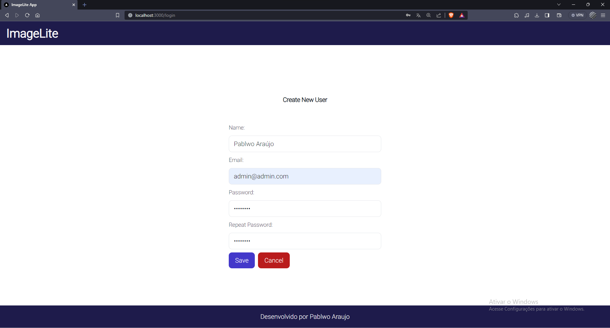
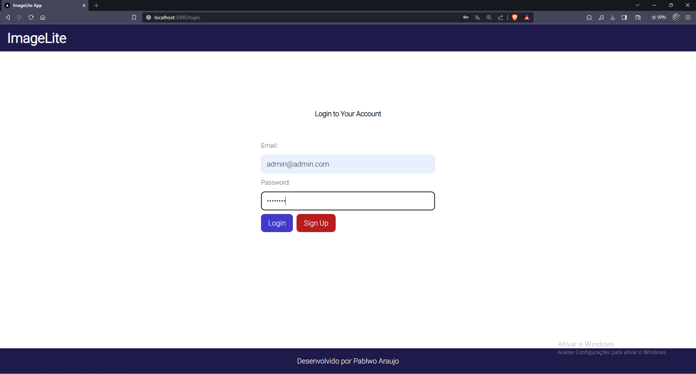
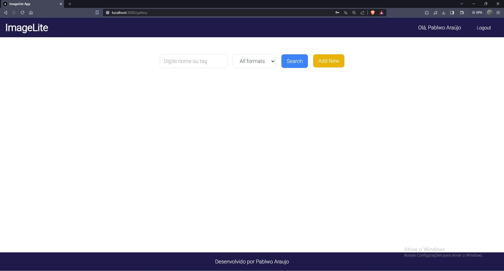
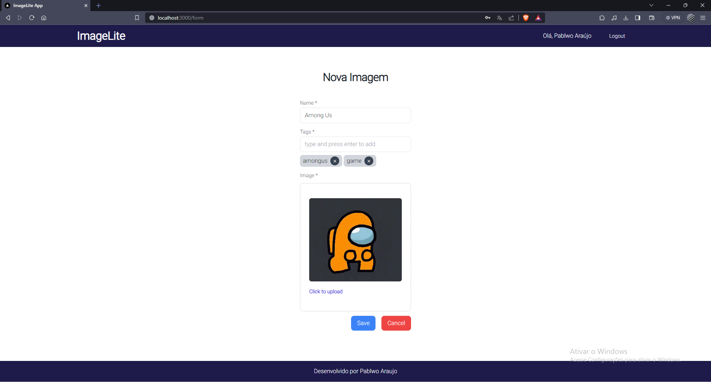
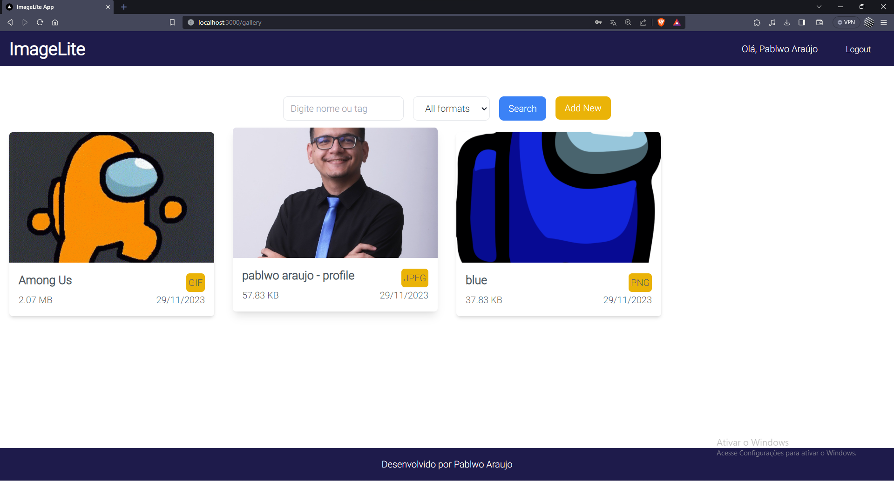

# image-lite

## 📋 Índice
- [📖 Descrição](#-Descrição)
- [🚀 Tecnologias utilizadas](#-Tecnologias-utilizadas)
- [📌 Como executar o projeto](#-Como-executar-o-projeto)
- [💻 Preview](#-Preview)
- [📌 Créditos](#-Créditos)
- [🎓 Certificado](#-Certificado)

## 📖 Descrição
Este projeto é uma aplicação web full stack que tem como objetivo principal a gestão de imagens, abrangendo desde o cadastro até a categorização e exibição. Como recurso de segurança, foi implementada autenticação JWT para proteger alguns recursos, como a busca e o upload de imagens. No frontend, a linguagem principal adotada foi o TypeScript, enquanto no backend, foi utilizado Java.

## 🚀 Tecnologias utilizadas
O projeto foi desenvolvido utilizando as seguintes tecnologias:

- [Spring Boot](https://spring.io/)
- [PostgreSQL](https://www.postgresql.org/)
- [JWT](https://jwt.io/)
- [Next.js](https://nextjs.org/)
- [TypeScript](https://www.typescriptlang.org/)
- [Tailwind CSS](https://tailwindcss.com/)
- [Formik](https://formik.org/)
- [Docker](https://www.docker.com/)

## 📌 Como executar o projeto

```bash
# Clone o repositório
git clone https://github.com/pablwoAraujo/image-lite

# Acesse o diretório
cd image-lite/

# Execute o comando para criar e iniciar os contêineres;
docker-compose up
```

## 💻 Preview
Página de cadastro |  Página de login
:-------------------------:|:-------------------------:
  |  

Página principal (Pesquisa) |  Página de cadastro (Nova imagem)
:-------------------------:|:-------------------------:
 |  

Página principal (Galeria) |
:-------------------------:|



## 📌 Créditos
- Curso [Fullstack Spring Boot + ReactJS do Zero ao Deploy no Docker](https://www.udemy.com/course/fullstack-spring-boot-reactjs-do-zero-ao-deploy-no-docker) | Instrutor [Dougllas Sousa](https://www.linkedin.com/in/dougllasfps/)
- Projeto base: [cursodsousa/fullstack-react-spring-2024](https://github.com/cursodsousa/fullstack-react-spring-2024)

## 🎓 Certificado
  - [Fullstack Spring Boot + ReactJS do Zero ao Deploy no Docker](https://www.udemy.com/certificate/UC-d87842da-b470-46c9-b18c-f81a7a950dd3/)